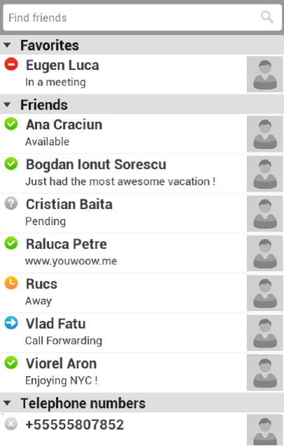

# Interviewapp demonstrate skills in Android development
## Task was
Create an application with a single activity that resembles the image below:
 

Apk file for install:  

There should be a list of people organized in groups. Each person has the following information:
- First Name
- Last Name
- Status Icon – {online, away, busy, offline, call forwarding, pending}
- Status Message
- Avatar –“contacts_list_avatar_unknown.png” should be used here

Recommended Environment:
- Android Studio
- Latest Android SDK
- Android device or emulator
- Android OS version newer than 4.3

## Stack
- rxjava2
- dagger
- DataBinding
- ViewModel
- LiveData
- androidx libraries
- mockito

# Hope you enjoy this project and will be useful for your projects

Created Aleksandr for demonstrate skills
Contacts : https://xandrwix.wixsite.com/resume